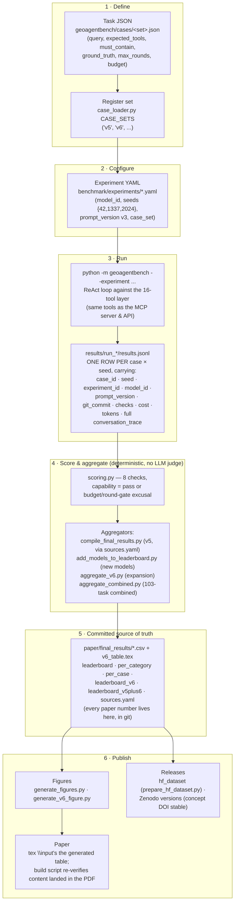

# Benchmark lifecycle & provenance (compliance view)

How a task travels from JSON to a number in the paper, and what makes every
number traceable back to the run that produced it. GitHub renders the diagram.

## The provenance chain (why any number is auditable)

1. **Row level** — every `results.jsonl` row records its `case_id`, `seed`,
   `experiment_id`, `model_id`, `prompt_version`, the **`git_commit`** of the
   harness that produced it, and the full conversation trace. A leaderboard
   cell can be traced to the exact run rows that produced it.
2. **Manifest level** — `paper/final_results/sources.yaml` maps each model's
   leaderboard entry to its specific run output directory.
3. **Artifact level** — the aggregators emit CSVs (and the drop-in
   `v6_table.tex`) that are **committed**; the paper `\input`s the generated
   table rather than retyping numbers, so paper ↔ CSV drift is impossible for
   tables and grep-auditable for prose.
4. **Scoring level** — the scorer is deterministic (8 rule-based checks, no
   LLM-as-judge), so re-scoring stored traces reproduces the same outcomes.

## Adding new tasks — the checklist

1. Add cases to a JSON set in `geoagentbench/cases/` (new file for a new
   version, e.g. `benchmark_v7.json`; never mutate a published set — published
   sets are frozen instruments).
2. Register the set name in `case_loader.py` (one line).
3. Clone experiment YAMLs pointing `case_set` at it; run all models × 3 seeds.
4. Aggregate: extend/reuse the scripts in `scripts/` so results land as
   committed CSVs under `paper/final_results/` — **a run that isn't aggregated
   into a committed CSV is invisible** (this bit us once: two models had full
   runs but were missing from the leaderboard for months).
5. Report the new set **both** separately **and** in the combined suite metric
   (`python3 -m scripts.aggregate_combined`), as done for v6 → the 103-task
   leaderboard.
6. Regenerate figures, `\input` the fresh table, rebuild the paper, and verify
   the new content is literally present in the PDF before calling it done.

## Versioning rules

- Published task sets are immutable; growth happens by adding a new set
  (v6, v7, …) so previously reported numbers stay reproducible forever.
- Headline metrics name their denominator explicitly ("93-task main suite",
  "combined 103 tasks") — never a bare percentage.
- Zenodo releases use one **concept DOI** (always resolves to latest) plus
  per-version DOIs; new data = new Zenodo version, never an edit in place.
